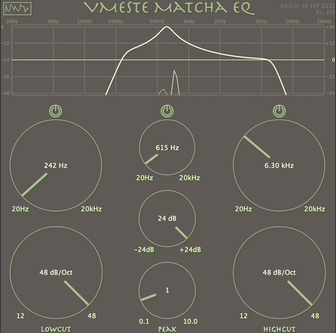

# VmesteMatchaEQ 🎚️

A modern 3-band parametric EQ plugin built with JUCE.  
VmesteBasedEQ is designed to give you precise control over your sound while staying light on CPU and easy on the eyes with its custom earth-tone interface.

---

## ✨ Features
- **3 Bands of Control**  
  - Low-cut filter: remove unwanted rumble and mud  
  - Peak/Bell filter: sculpt and shape your mids  
  - High-cut filter: smooth out harsh highs  

- **Real-Time Spectrum Analyzer**  
  - Instantly see how your adjustments affect the sound  
  - Dual-channel display for left/right clarity  

- **Zero Latency, Low CPU**  
  - Optimized DSP engine for mixing and mastering without slowing down your DAW  

- **Intuitive UI**  
  - Earth-tone color palette  
  - Smooth rotary knobs with automation support  
  - Bypass switches for each band  

---

## 🎥 Demo
*Here’s VmesteBasedEQ in action:*  




## 🎛 Use Cases
- **Vocals**: Add clarity and tame sibilance  
- **Drums**: Punch up kicks and smooth cymbals  
- **Bass**: Tighten the low end and carve definition  
- **Mastering**: Subtle shaping for polished mixes  

---

## 📂 Source Build
To build from source you’ll need:  
- [JUCE 6+](https://juce.com)  
- Xcode (macOS) or Visual Studio 2019+ (Windows)  

Clone and build:  
```bash
git clone https://github.com/nikitasmelk/VST-firstEq.git
cd VST-firstEq
